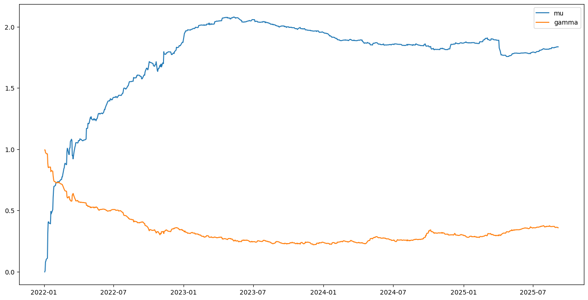
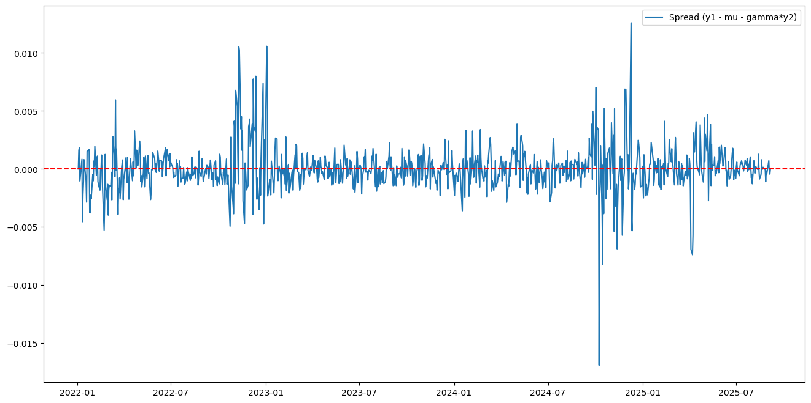
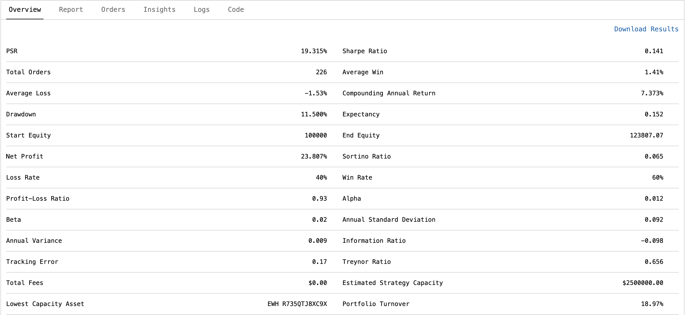

## Methodology

### Step 1: Pair Selection & Statistical Checks
Before applying the Kalman filter, we verify that the chosen stocks form a valid pair:

1. Unit root tests (ADF, KPSS): ensure both series are $I(1)$.  
2. Engle-Granger cointegration test: ensures the residuals are stationary.  
3. Half-life estimation: checks how quickly the spread mean-reverts.  
4. Rolling betas: test for hedge ratio stability.  

Formally, an OLS regression is first run:

$
y_{1t} = \alpha + \beta y_{2t} + \varepsilon_t
$

and we test whether the residuals $\varepsilon_t$ are stationary.

**Example diagnostics (from one stock pair):**

$
\hat{\beta} = -0.411, \quad \hat{\alpha} = 4.196
$

- KPSS test: confirms one series is $I(1)$ ($p < 0.05$)  
- Engle-Granger p-value: 0.376 (weak evidence of cointegration)  
- ADF on residuals: $p = 0.021$ (residuals stationary at 5% level)  
- Half-life: $\approx 57.5$ days  
- Rolling beta standard deviation: 0.291 (unstable hedge ratio)  

**Verdict summary:**  

$
\{ y_\text{level\_nonstationary}: \text{True}, x_\text{level\_nonstationary}: \text{False}, \varepsilon_\text{stationary}: \text{False}, \text{half-life reasonable}: \text{True}, \beta_\text{stable}: \text{False} \}
$

---

### Step 2: From Linear Regression to Dynamic Parameters
The spread of the log prices of two stocks is defined as:

$
s_t = y_{1t} - \gamma y_{2t} = \mu + \varepsilon_t
$

where $\gamma$ allows the spread to be centered around $\mu$.

Then:

$
y_{1t} = \mu + \gamma y_{2t} + \varepsilon_t
$

Assuming constant $\mu$ and $\gamma$ is restrictive since market relationships change over time. To capture this, the coefficients are allowed to vary dynamically:

$
y_{1t} = \mu_t + \gamma_t y_{2t} + \varepsilon_t
$

so that at each time step $t$, the spread

$
s_t = y_{1t} - \mu_t - \gamma_t y_{2t}
$

remains stationary and mean-reverting around zero.

---

### Step 3: Kalman Filter Mechanics
At each time step, the Kalman filter runs two main steps: prediction and update.

#### 1. Predict

$
\hat{x}_{t}^{-} = A \hat{x}_{t-1}, \quad
P_{t}^{-} = A P_{t-1} A^\top + Q
$

- $\hat{x}_{t}^{-}$: predicted state vector (prior) at time $t$  
- $\hat{x}_{t-1}$: updated state from previous step  
- $A$: state transition matrix (identity for random walk)  
- $P_{t}^{-}$: predicted error covariance  
- $P_{t-1}$: updated error covariance from previous step  
- $Q$: process noise covariance  

> Predicts the next state and its uncertainty before seeing the observation.

#### 2. Compute Kalman Gain & Update

$
K_t = P_{t}^{-} H_t^\top (H_t P_{t}^{-} H_t^\top + R)^{-1}
$

$
\hat{x}_t = \hat{x}_{t}^{-} + K_t (z_t - H_t \hat{x}_{t}^{-})
$

$
P_t = (I - K_t H_t) P_{t}^{-}
$

- $K_t$: Kalman gain  
- $H_t$: observation matrix, here $[1, y_{2t}]$  
- $R$: observation noise covariance  
- $z_t$: observed measurement ($y_{1t}$)  
- $\hat{x}_t$: updated state estimate (posterior)  
- $P_t$: updated error covariance  

> Updates the predicted state using the new observation.

#### 3. Compute Spread

$
s_t = y_{1t} - \mu_t - \gamma_t y_{2t}
$

- $s_t$: residual spread at time $t$  
- $\mu_t, \gamma_t$: dynamically estimated intercept and hedge ratio  

> The spread $s_t$ is expected to mean-revert around zero.

---

### Step 4: Implementation
The Kalman filter is implemented in `pairs_trading_kalman.ipynb` as a custom Python class estimating dynamic $\mu_t$ and $\gamma_t$.

#### Initialization

$
x_0 =
\begin{bmatrix}
0 \\
1
\end{bmatrix}, \quad
P_0 = I
$

- $x_0$: initial state vector $[\mu_0, \gamma_0]^T$  
- $P_0$: initial covariance matrix  
- $I$: $2\times2$ identity matrix  

> Assumes neutral intercept and unit hedge ratio at $t=0$.

#### Noise Terms

- Process noise $Q$: represents uncertainty in $\mu_t$ and $\gamma_t$  
- Observation noise $R$: rolling variance of $y_1$  

#### Dynamic Estimation

Predict:

$
x_t^- = A x_{t-1}, \quad P_t^- = A P_{t-1} A^\top + Q
$

Update:

$
K_t = P_t^- H_t^\top (H_t P_t^- H_t^\top + R)^{-1}
$

$
x_t = x_t^- + K_t (z_t - H_t x_t^-)
$

$
P_t = (I - K_t H_t) P_t^-
$

- $x_t = [\mu_t, \gamma_t]^T$: updated estimates  
- $H_t = [1, y_{2t}]$: observation matrix  
- $z_t = y_{1t}$: observed log-price  
- $K_t$: Kalman gain  

> Filter adjusts $\mu_t$ and $\gamma_t$ to best fit new observations.

#### Compute Spread

$
s_t = y_{1t} - \mu_t - \gamma_t y_{2t}
$

> Updated $\mu_t$ and $\gamma_t$ are used to compute the spread.

#### Outputs

- Time series of $\mu_t$ (intercept)  
- Time series of $\gamma_t$ (hedge ratio)  
- Spread $s_t$  

---

### Step 5: QuantConnect Implementation
The Kalman filter-based pairs trading strategy is implemented in QuantConnect, trading $y_1$ and $y_2$ dynamically based on the estimated spread and hedge ratio.

#### Trading Logic

- Z-score of spread:

$
z_t = \frac{s_t - \text{mean}(s_{t-w:t})}{\text{std}(s_{t-w:t})}
$

- Entry Rules: Initiate positions when the spread deviates significantly from its mean. Use $\gamma_t$ for market-neutral sizing:

$
\text{hedge shares} = \text{base shares} \cdot \gamma_t \cdot \frac{y_1}{y_2}
$

- Exit Rules: Close positions when spread reverts or losses exceed risk thresholds.

- Realized P&L:

$
\text{PNL}_t = (y_{1t} - y_{1,\text{entry}}) \cdot q_1 + (y_{2t} - y_{2,\text{entry}}) \cdot q_2
$

#### Outputs & Visualization

---

## Future Work
- Explore alternative scaling of process and observation noise for robustness  
- Extend to multi-asset pairs or ETFs for portfolio-level strategies  
- Conduct comprehensive backtesting with transaction costs  
- Incorporate dynamic volatility metrics (e.g., VIX) for adaptive process noise  

---

## Tools & Libraries
- Python 3.x  
- [polars](https://www.pola.rs/) for data manipulation  
- [yfinance](https://pypi.org/project/yfinance/) for stock data  
- [statsmodels](https://www.statsmodels.org/) for statistical tests and regressions  
- [matplotlib](https://matplotlib.org/) for plotting  
- [numpy](https://numpy.org/) & [pandas](https://pandas.pydata.org/) for array and DataFrame operations
