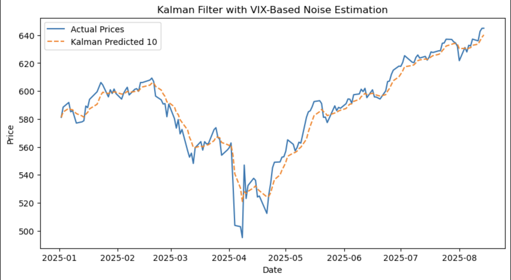

# Kalman Filter Stock Prediction

## Overview
This project implements a **Kalman Filter** to estimate SPY prices using the VIX as a proxy for volatility-based noise.  
The filter aims to extract the "true" underlying price from noisy observations and adapt to changing market conditions.

---

## Data
- **SPY** daily close prices via Yahoo Finance  
- **VIX** daily close prices via Yahoo Finance  
- Date range: 2025-01-01 onwards  
- Both series are aligned to the same dates and missing values are forward-filled

---

## Methodology

### Kalman Filter Theory
The Kalman Filter estimates the hidden state \( \hat{x}_t \) (true price) using a two-step process:  

**1. Prediction (Time Update):**
\[
\hat{x}_{t|t-1} = F \hat{x}_{t-1|t-1}
\]  
\[
P_{t|t-1} = F P_{t-1|t-1} F^\top + Q
\]

**2. Correction (Measurement Update):**
\[
K_t = P_{t|t-1} (P_{t|t-1} + R)^{-1}
\]  
\[
\hat{x}_{t|t} = \hat{x}_{t|t-1} + K_t (z_t - \hat{x}_{t|t-1})
\]  
\[
P_{t|t} = (I - K_t) P_{t|t-1}
\]

Where:  
- \( \hat{x} \) = estimated state (price)  
- \( P \) = error covariance  
- \( F \) = state transition matrix (1 for SPY)  
- \( Q \) = process noise covariance (from VIX daily variance)  
- \( R \) = measurement noise covariance (scaled VIX)  
- \( K_t \) = Kalman gain  
- \( z_t \) = observed price

### Implementation Details
1. **Fetch data:** SPY and VIX from Yahoo Finance using `yfinance`.  
2. **Calculate noise terms:**
   - Process noise \( Q \) = daily variance of VIX  
   - Measurement noise \( R \) = scaled by factor 5 for sensitivity testing  
3. **Initialize Kalman Filter** using `pykalman` with SPY starting price  
4. **Filter SPY prices** to produce predicted state means  
5. **Plot actual vs filtered prices**

---

## Results

The Kalman Filter prediction compared to actual SPY prices:



The filter adapts to volatility changes in the market and smooths out short-term fluctuations while tracking the underlying trend.

---

## Future Work
- Test multiple scaling factors for measurement noise to evaluate sensitivity  
- Extend the filter to multiple ETFs or stocks for portfolio-level predictions  
- Backtest trading strategies based on Kalman predictions  
- Include dynamic process noise estimation using VIX and other volatility metrics

---

## Tools & Libraries
- Python 3.x  
- [polars](https://www.pola.rs/) for data manipulation  
- [yfinance](https://pypi.org/project/yfinance/) for stock data  
- [pykalman](https://github.com/pykalman/pykalman) for Kalman Filter  
- [matplotlib](https://matplotlib.org/) for plotting

---

## How to Run
```bash
# Install dependencies
pip install -r requirements.txt

# Run the Kalman filter script
python src/kalman_filter.py
